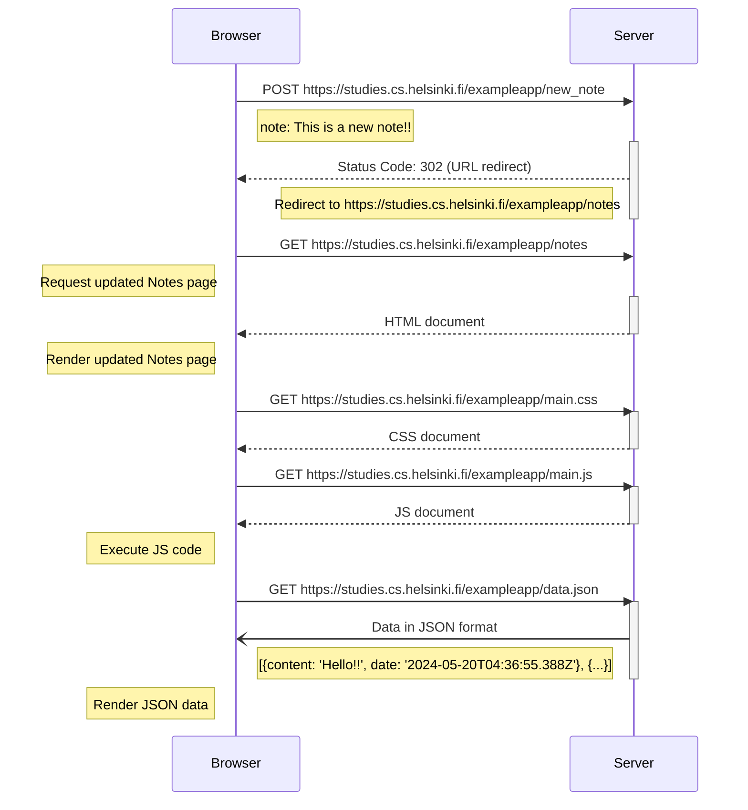

# Full Stack Open Excersise 0.4

## New note diagram

```mermaid
sequenceDiagram
    participant B as Browser
    participant S as Server
    B ->> S: POST https://studies.cs.helsinki.fi/exampleapp/new_note
    Note right of B:  note: This is a new note!!
    activate S
    S -->> B: Status Code: 302 (URL redirect)
    Note left of S: Redirect to https://studies.cs.helsinki.fi/exampleapp/notes
    deactivate S
    B ->> S: GET https://studies.cs.helsinki.fi/exampleapp/notes
    Note left of B: Request updated Notes page
    activate S
    S -->> B: HTML document
    deactivate S
    Note left of B: Render updated Notes page
    B ->> S: GET https://studies.cs.helsinki.fi/exampleapp/main.css
    activate S
    S -->> B: CSS document
    deactivate S
    B ->> S: GET https://studies.cs.helsinki.fi/exampleapp/main.js
    activate S
    S -->> B: JS document
    deactivate S
    Note left of B: Execute JS code
    B ->> S: GET https://studies.cs.helsinki.fi/exampleapp/data.json
    activate S
    S -) B: Data in JSON format
    Note left of S: [{content: 'Hello!!', date: '2024-05-20T04:36:55.388Z'}, {...}] 
    deactivate S
    Note left of B: Render JSON data
```