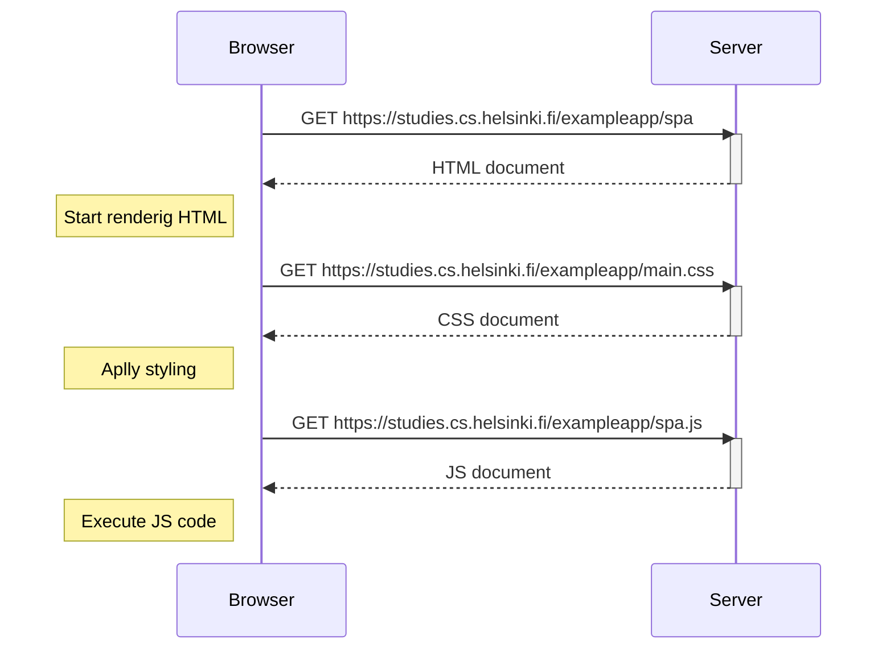

# Full Stack Open Excersise 0.5

## Single page app diagram

```mermaid
sequenceDiagram
    participant B as Browser
    participant S as Server
    B ->> S: GET https://studies.cs.helsinki.fi/exampleapp/spa 
    activate S
    S -->> B: HTML document
    deactivate S
    Note left of B: Start renderig HTML
    B ->> S: GET https://studies.cs.helsinki.fi/exampleapp/main.css
    activate S
    S -->> B: CSS document
    deactivate S
    Note left of B: Aplly styling
    B ->> S: GET https://studies.cs.helsinki.fi/exampleapp/spa.js
    activate S
    S -->> B: JS document
    deactivate S
    Note left of B: Execute JS code 
```